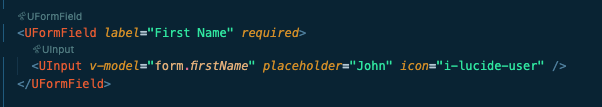
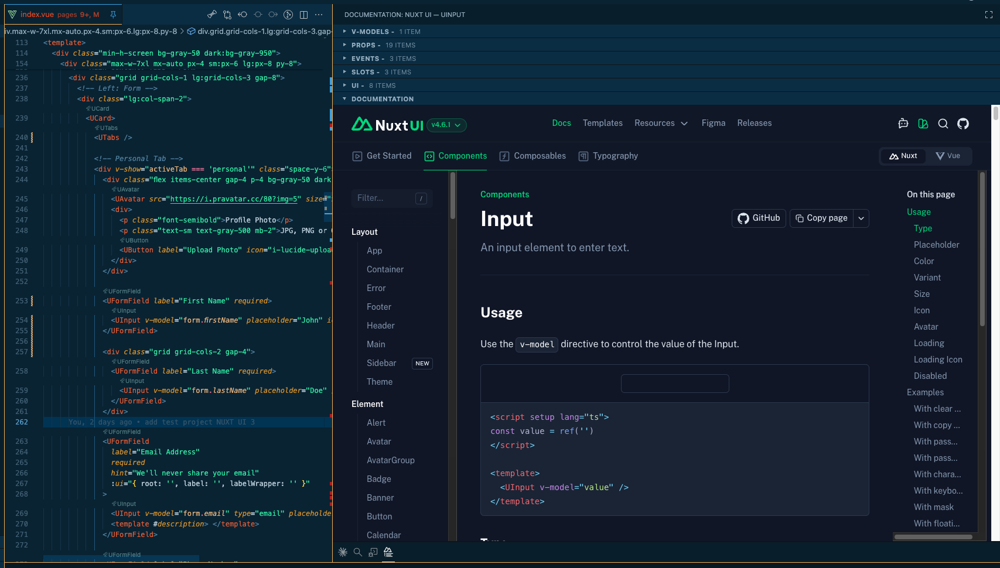
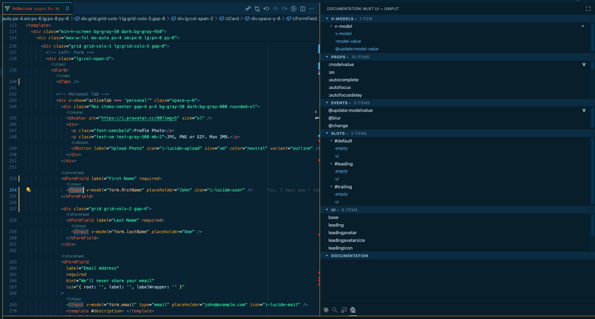

# Nuxt UI Code Lens

VS Code extension that brings [Nuxt UI](https://ui.nuxt.com) component intelligence directly into your editor.

Requires **Nuxt UI v3 or v4**.

## Features

- **CodeLens for every component** — above each `<U…>` tag, interactive lenses list the component's props, slots, events, v-models, and UI keys at a glance

- **One-click documentation**

- **One-click props injection**

- **Auto version detection** — reads `@nuxt/ui` from `package.json` and targets the correct v3 or v4 documentation automatically

## Settings

| Setting                           | Default | Description                                          |
| --------------------------------- | ------- | ---------------------------------------------------- |
| `nuxtUiCodeLens.version`          | `auto`  | Force `v3`, `v4`, or auto-detect from `package.json` |
| `nuxtUiCodeLens.codeLens.enabled` | `true`  | Enable or disable CodeLens on Nuxt UI component tags |
